# Azure Deployment Platform - Architecture

## System Architecture

```mermaid
flowchart TD
    Dev[Developer Experience<br/>git push] --> Repo

    Repo[GitHub Repository - Monorepo<br/>apps/team-a/app-1/<br/>├── app-config.yml<br/>├── backend/<br/>│   ├── Dockerfile<br/>│   └── code]

    Repo -->|On PR| Validation[Validation Workflow<br/>1. Parse config<br/>2. Validate schema<br/>3. Estimate costs<br/>4. Lint Dockerfiles<br/>5. Post PR comments]

    Repo -->|On Merge| Deploy[Deployment Workflow]

    Deploy --> Phase1[Phase 1: ACR<br/>• Terraform init<br/>• Create ACR]
    Phase1 --> Phase2[Phase 2: Build<br/>• Build images<br/>• Push to ACR]
    Phase2 --> Phase3[Phase 3: Deploy<br/>• Create ACI<br/>• Output URLs]

    Phase3 --> Azure[Azure Infrastructure]

    Azure --> RG[Resource Group<br/>rg-app-env]
    Azure --> ACR[Container Registry<br/>Stores Docker images]
    Azure --> ACI[Container Instances<br/>Backend Container<br/>Frontend Container]
    Azure --> State[Terraform State<br/>Blob Storage<br/>Per-app isolation]

    ACI --> URL[https://app.uksouth.azurecontainer.io]

    style Dev fill:#e1f5ff
    style Repo fill:#fff4e1
    style Validation fill:#e8f5e9
    style Deploy fill:#f3e5f5
    style Azure fill:#ffe0e0
    style URL fill:#e0f7fa
```



## Key Components

### 1. **Monorepo Structure**
- **What:** All applications in one repository under `apps/TEAM/APP/`
- **Why:** Centralized control, shared credentials, consistent validation
- **Trade-off:** Larger repo, but better governance

### 2. **Configuration-Driven Deployment**
- **What:** Declare what you want in `app-config.yml`
- **How:** Platform translates config → Terraform → Azure resources
- **Benefit:** No need to understand Azure or Terraform

### 3. **Two-Phase Deployment**

**Phase 1: Infrastructure (ACR)**
```
Terraform creates Container Registry
→ State saved to Azure Blob Storage
```

**Phase 2: Images**
```
Docker builds images from your Dockerfiles
→ Push to ACR with commit SHA tags
```

**Phase 3: Deployment (ACI)**
```
Terraform creates Container Instances
→ References images from ACR
→ Outputs public URLs
```

**Why separate phases?**
- Terraform can't build Docker images
- Need ACR to exist before pushing images
- Need images to exist before deploying containers

### 4. **Validation Framework**

```mermaid
flowchart TD
    Config[app-config.yml] --> Schema[JSON Schema<br/>Validates structure]
    Schema --> Rules[Custom Rules<br/>Business logic validation<br/>unique names, Dockerfile exists, etc.]
    Rules --> Errors[Explanatory Errors<br/>Generate messages with:<br/>• What's wrong<br/>• Why it matters<br/>• How to fix]

    style Config fill:#fff4e1
    style Schema fill:#e1f5ff
    style Rules fill:#e8f5e9
    style Errors fill:#ffe0e0
```



### 5. **State Management**

**Problem:** Multiple apps deploying concurrently could corrupt shared Terraform state.

**Solution:** Per-app state isolation

```
Azure Blob Storage
├── tfstate/
│   ├── team-a/
│   │   ├── app-1/
│   │   │   └── terraform.tfstate  ◄─── App 1's state
│   │   └── app-2/
│   │       └── terraform.tfstate  ◄─── App 2's state
│   └── team-b/
│       └── app-3/
│           └── terraform.tfstate  ◄─── App 3's state
```

Each app's deployment is completely isolated.

## Data Flow

### Pull Request (Validation)

```mermaid
sequenceDiagram
    participant Dev as Developer
    participant GH as GitHub
    participant Val as Validation Workflow
    participant PR as Pull Request

    Dev->>GH: Create PR modifying apps/team-a/app-1/
    GH->>Val: Trigger app-validation.yml
    Val->>Val: Detect changed apps (git diff)

    loop For each changed app
        Val->>Val: Parse app-config.yml
        Val->>Val: Validate against JSON schema
        Val->>Val: Run custom validation rules
        Val->>Val: Estimate Azure costs
        Val->>Val: Lint Dockerfiles
    end

    Val->>PR: Post comments:<br/>📋 Changes detected<br/>✅ Validation results<br/>💰 Cost estimation<br/>🐳 Dockerfile linting<br/>📊 Summary

    PR->>Dev: Show feedback

    alt Issues found
        Dev->>GH: Fix issues, push again
        Note over GH,Val: Steps repeat automatically
    else All checks pass
        Dev->>GH: Merge PR
    end
```



### Merge (Deployment)

```
1. PR merged to main

2. GitHub triggers: .github/workflows/app-deployment.yml
   ↓
3. Detect changed apps (git diff)
   ↓
4. For each changed app:

   ┌─────────────────────────────────────────┐
   │ Phase 1: Create ACR                     │
   ├─────────────────────────────────────────┤
   │ • cd platform/terraform/modules/app-stack│
   │ • terraform init                         │
   │   -backend-config="key=team/app/..."    │
   │ • terraform plan (create_containers=false)│
   │ • terraform apply                        │
   │ • Upload state as artifact               │
   └─────────────────────────────────────────┘
                    ↓
   ┌─────────────────────────────────────────┐
   │ Phase 2: Build & Push Images            │
   ├─────────────────────────────────────────┤
   │ • az acr login                           │
   │ • docker build backend/                  │
   │ • docker tag with commit SHA             │
   │ • docker push to ACR                     │
   │ • Same for frontend (if enabled)         │
   └─────────────────────────────────────────┘
                    ↓
   ┌─────────────────────────────────────────┐
   │ Phase 3: Deploy Containers              │
   ├─────────────────────────────────────────┤
   │ • Download state artifact from Phase 1   │
   │ • terraform plan (create_containers=true)│
   │ • terraform apply                        │
   │ • Output public URLs                     │
   └─────────────────────────────────────────┘
                    ↓
5. Application running at:
   https://app-backend.uksouth.azurecontainer.io
   https://app-frontend.uksouth.azurecontainer.io
```

## Security Model

### Credentials
- **Azure Service Principal** - Stored as GitHub repository secrets
- **Scope:** Contributor role on subscription
- **Access:** Only GitHub Actions workflows can access

### Secrets Flow
```
GitHub Repository Secrets
    │
    │ Available to workflows only
    ▼
GitHub Actions Runner
    │
    │ Used during workflow execution
    ▼
Azure API
    │
    │ Creates resources
    ▼
Azure Resources (scoped to service principal)
```

### Developer Access
- Developers **do not** need Azure credentials
- Developers **do not** have Azure portal access
- Developers **only** interact via Git (PR workflow)

## Cost Model

### Estimation
```
app-config.yml
    │
    ▼
scripts/estimate-costs.py
    │
    ├─ Parse CPU/memory configs
    ├─ Lookup Azure UK South pricing
    ├─ Calculate monthly costs per resource
    ├─ Generate breakdown
    └─ Suggest optimizations
    │
    ▼
Displayed in PR comments before deployment
```

### Actual Costs
```
Azure Resources
    │
    ├─ Container Instances (always-on)
    ├─ Container Registry (storage)
    ├─ Data transfer (egress)
    └─ Database (if enabled)
    │
    ▼
Billed to: Azure subscription
Tagged with: app name, team, environment
```

## Scalability

### Current Scale
- **Apps:** Unlimited (each has isolated state)
- **Concurrency:** Multiple apps can deploy simultaneously
- **Resources per app:**
  - 1 Resource Group
  - 1 Container Registry
  - 1-2 Container Instances (backend/frontend)
  - 0-1 Database (optional)

### Limitations
- **Container Instances:** Not auto-scaling (fixed resources)
- **Single Region:** Currently UK South only
- **No load balancing:** Single container per component

### Future Improvements
- **App Service** for auto-scaling
- **Multi-region** deployments
- **Load balancers** for HA
- **Kubernetes** for complex workloads

## Design Decisions (ADRs)

### ADR-001: Monorepo vs Multi-repo
**Decision:** Monorepo with all apps in one repository

**Rationale:**
- Centralized validation (can enforce standards)
- Single set of credentials (no per-repo secret management)
- Easier to evolve platform (workflows in same repo)

**Trade-off:** Larger repository, all teams have read access

### ADR-002: Container Instances vs App Service
**Decision:** Azure Container Instances for initial version

**Rationale:**
- Simpler (no app service plans)
- Cheaper for small apps
- Faster cold starts
- Good fit for dev/test environments

**Trade-off:** No auto-scaling, less suitable for production

### ADR-003: Two-Phase Deployment
**Decision:** Separate ACR creation from container deployment

**Rationale:**
- Terraform can't build Docker images
- Need ACR to exist before pushing images
- Clear separation of concerns

**Trade-off:** More complex workflow, longer deployment time

### ADR-004: Explainable Errors
**Decision:** Every validation error includes "why" and "how to fix"

**Rationale:**
- Reduces support burden
- Empowers developers
- Faster time to resolution
- Better developer experience

**Trade-off:** More complex validation code

## Technology Stack

### Infrastructure
- **Terraform:** Infrastructure as Code
- **Azure Container Registry:** Docker image storage
- **Azure Container Instances:** Container hosting
- **Azure Blob Storage:** Terraform state storage

### Automation
- **GitHub Actions:** CI/CD workflows
- **Python:** Validation and cost estimation scripts
- **Bash:** Workflow orchestration
- **yq:** YAML parsing in workflows

### Validation
- **JSON Schema:** Config file validation
- **Hadolint:** Dockerfile linting
- **Custom Python:** Business logic validation

## Monitoring & Observability

### Current State
- **Deployment logs:** GitHub Actions workflow logs
- **Application logs:** `az container logs --name {app}`
- **Resource status:** Azure Portal or CLI

### Future Improvements
- Azure Application Insights integration
- Centralized logging (Log Analytics)
- Alerting on deployment failures
- Cost tracking dashboards

## Comparison: Before vs After

### Before (Template Repository Pattern)
```
Developer workflow:
1. Create new repo from template
2. Configure Azure credentials (6 secrets)
3. Update Terraform variables
4. Understand Terraform
5. Push to deploy

Issues:
- Credential sprawl (secrets per repo)
- No validation before deployment
- No cost visibility
- Inconsistent infrastructure
- Requires Terraform knowledge
```

### After (Centralized Platform)
```
Developer workflow:
1. Add app directory
2. Create app-config.yml
3. Create PR
4. Review automated feedback
5. Merge to deploy

Benefits:
- Single set of credentials
- Validation catches errors in PR
- Cost estimates before deployment
- Consistent infrastructure
- No Terraform knowledge needed
```

## Key Metrics

### Developer Experience
- **Time to first deployment:** ~15 minutes (from clone to live)
- **Lines of config required:** ~20 lines of YAML
- **Azure knowledge needed:** None
- **Feedback loop:** Instant (validation in PR)

### Platform Metrics
- **Apps deployed:** Tracked in `apps/_registry.yml`
- **Validation success rate:** Visible in PR comments
- **Deployment success rate:** Visible in Actions tab
- **Average deployment time:** ~7-10 minutes per app

---

**Questions about the architecture?** Check `platform/docs/decision-log.md` for detailed reasoning behind each decision.
